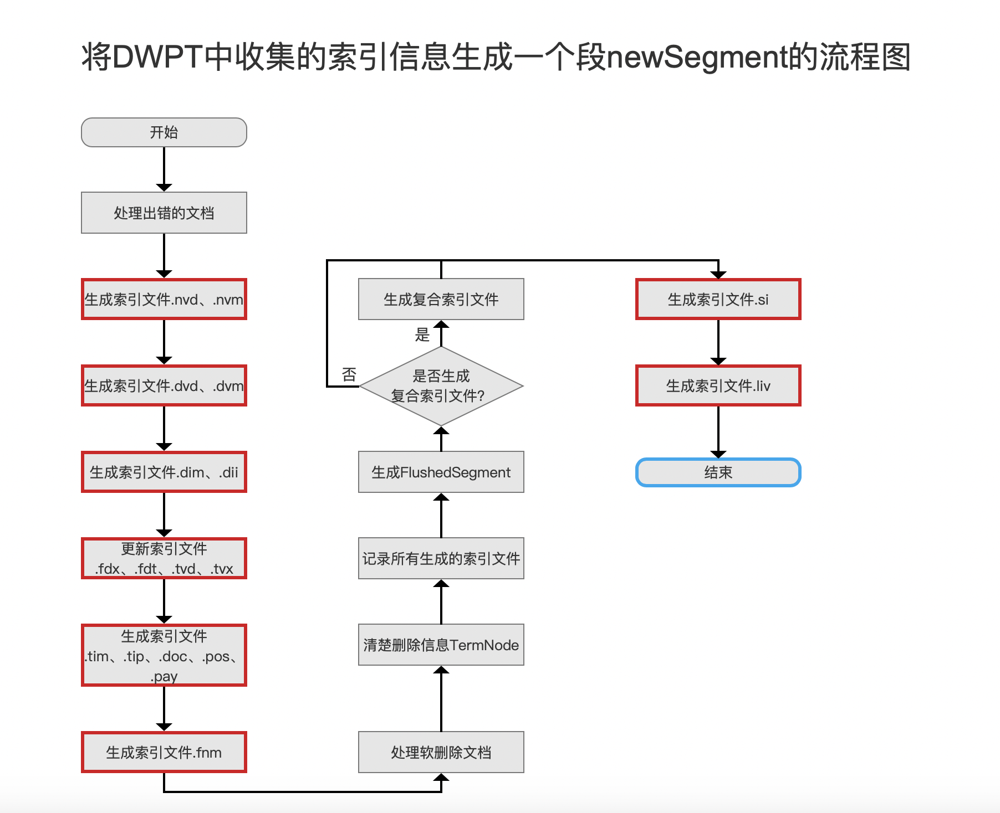
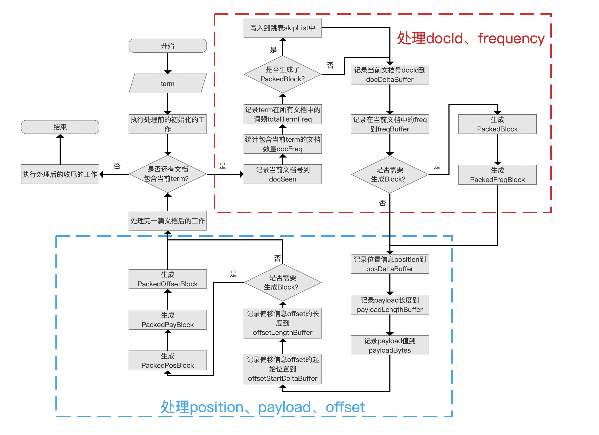
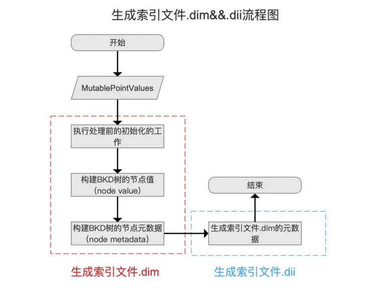

# lucene 索引操作 
## 前文阅读
[elasticsearch-数据写流程](https://zhuanlan.zhihu.com/p/156904473)

## Lucene 写索引测试用例

紧接前文 lucene接收到来自es的调用 开始写入数据 再写translog

translog记录了写入lucene的一些操作，以及内容 在RecoveryState模块以及Translog模块中 RecoveryState类内部所有方法都采用了synchronized重量级锁

根据translog去恢复lucene中的数据，暂且不表，单看lucene

lucene的测试用例，IndexFiles，位于
org.apache.lucene.demo package

从main方法进入看,官方demo给出的场景是，添加一个目录峡的所有文件路径写成索引

往下走，判断文件可读性，之后打开文件目录 设置索引文件目录

Directory 用来维护索引目录中的索引文件，定义了 创建、打开、删除、读取、重命名、同步(持久化索引文件至磁盘)、校验和（checksum computing）等抽象方法，索引目录中不存在多级目录，即不存在子文件夹的层次结构(no sub-folder hierarchy)

之后加载分析器 解析器 用于 解析 String

在调用 IndexWriter 的构造函数之前，我们需要先初始化 IndexWriter 的配置信息 IndexWriterConfig，IndexWriterConfig 中的配置信息按照可以分为两类：

不可变配置（unmodifiable configuration）：在实例化 IndexWriter 对象后，这些配置不可更改，即使更改了，也不会生效，因为仅在 IndexWriter 的构造函数中应用一次这些配置

可变配置（modifiable configuration）：在实例化 IndexWriter 对象后，这些配置可以随时更改

在此基础之上，加载IndexWriterConfig
```Java
   Directory dir = FSDirectory.open(Paths.get(indexPath));
      Analyzer analyzer = new StandardAnalyzer();
      IndexWriterConfig iwc = new IndexWriterConfig(analyzer);
```
之后通过写入的标志位判断，设置 OpenMode，
OpenMode的主要作用是在之前的索引目录中已有的索引文件，该如何处理。

```Java
      if (create) {
        // Create a new index in the directory, removing any
        // previously indexed documents:
        iwc.setOpenMode(OpenMode.CREATE);
      } else {
        // Add new documents to an existing index:
        iwc.setOpenMode(OpenMode.CREATE_OR_APPEND);
      }
```

之后 开始后续步骤 初始化indexWriter
```Java
 IndexWriter writer = new IndexWriter(dir, iwc);
      indexDocs(writer, docDir);
  static void indexDocs(final IndexWriter writer, Path path) throws IOException {
    if (Files.isDirectory(path)) {
      Files.walkFileTree(path, new SimpleFileVisitor<Path>() {
        @Override
        public FileVisitResult visitFile(Path file, BasicFileAttributes attrs) throws IOException {
          try {
            indexDoc(writer, file, attrs.lastModifiedTime().toMillis());
          } catch (IOException ignore) {
            // don't index files that can't be read.
          }
          return FileVisitResult.CONTINUE;
        }
      });
    } else {
      indexDoc(writer, path, Files.getLastModifiedTime(path).toMillis());
    }
  }
```
如下是IndexWriter内部的一些参数和赋值情况。
```
analyzer=org.apache.lucene.analysis.standard.StandardAnalyzer
ramBufferSizeMB=16.0
maxBufferedDocs=-1
mergedSegmentWarmer=null
delPolicy=org.apache.lucene.index.KeepOnlyLastCommitDeletionPolicy
commit=null
openMode=CREATE
similarity=org.apache.lucene.search.similarities.BM25Similarity
mergeScheduler=ConcurrentMergeScheduler: maxThreadCount=1, maxMergeCount=6, ioThrottle=true
codec=Lucene86
infoStream=org.apache.lucene.util.InfoStream$NoOutput
mergePolicy=[TieredMergePolicy: maxMergeAtOnce=10, maxMergeAtOnceExplicit=30, maxMergedSegmentMB=5120.0, floorSegmentMB=2.0, forceMergeDeletesPctAllowed=10.0, segmentsPerTier=10.0, maxCFSSegmentSizeMB=8.796093022207999E12, noCFSRatio=0.1, deletesPctAllowed=33.0
readerPooling=true
perThreadHardLimitMB=1945
useCompoundFile=true
commitOnClose=true
indexSort=null
checkPendingFlushOnUpdate=true
softDeletesField=null
maxCommitMergeWaitMillis=0
writer=org.apache.lucene.index.IndexWriter@29626d54

```

接下来再来看indexDocs方法。
```java
 if (Files.isDirectory(path)) {
      Files.walkFileTree(path, new SimpleFileVisitor<Path>() {
        @Override
        public FileVisitResult visitFile(Path file, BasicFileAttributes attrs) throws IOException {
          try {
            indexDoc(writer, file, attrs.lastModifiedTime().toMillis());
          } catch (IOException ignore) {
            // don't index files that can't be read.
          }
          return FileVisitResult.CONTINUE;
        }
      });
    } else {
      indexDoc(writer, path, Files.getLastModifiedTime(path).toMillis());
    }
```

这里重写了SimpleFileVisitor对象中的visitFile方法，若path还有则继续访问 调用indexDoc方法。
```Java
static void indexDoc(IndexWriter writer, Path file, long lastModified) throws IOException {
    try (InputStream stream = Files.newInputStream(file)) {
      Document doc = new Document();
      Field pathField = new StringField("path", file.toString(), Field.Store.YES);
      //path域名
      doc.add(pathField);
      //上一次修改的时间
      doc.add(new LongPoint("modified", lastModified));
      //文本内容 写入流的内容
      doc.add(new TextField("contents", new BufferedReader(new InputStreamReader(stream, StandardCharsets.UTF_8))));
      //判断关键词 是写入模式还是更新模式 ，进行调用
      if (writer.getConfig().getOpenMode() == OpenMode.CREATE) {
        System.out.println("adding " + file);
        writer.addDocument(doc);
      } else {
        System.out.println("updating " + file);
        writer.updateDocument(new Term("path", file.toString()), doc);
      }
    }
```
addDocument以及 updateDocument方法
这两个方法的区别 在于Term对象，一个是全Term创建，一个是针对部分Term进行创建

```Java
    public long addDocument(Iterable<? extends IndexableField> doc) throws IOException {
    return updateDocument(null, doc);
  }
    public long updateDocument(Term term, Iterable<? extends IndexableField> doc) throws IOException {
    return updateDocuments(term == null ? null : DocumentsWriterDeleteQueue.newNode(term), List.of(doc));
  }
```
最终指向updateDocuments方法

```Java
private long updateDocuments(final DocumentsWriterDeleteQueue.Node<?> delNode, Iterable<? extends Iterable<? extends IndexableField>> docs) throws IOException {
    ensureOpen();//确保文件能够正常打开
    boolean success = false;
    try {
      final long seqNo = maybeProcessEvents(docWriter.updateDocuments(docs, delNode));
      success = true;
      return seqNo;
    } catch (VirtualMachineError tragedy) {
      tragicEvent(tragedy, "updateDocuments");
      throw tragedy;
    } finally {
      if (success == false) {
        if (infoStream.isEnabled("IW")) {
          infoStream.message("IW", "hit exception updating document");
        }
        maybeCloseOnTragicEvent();
      }
    }
  }
```
updateDocuments 该方法是底层方法
调用的是DocumentsWriter类
```Java
package org.apache.lucene.index;
long updateDocuments(final Iterable<? extends Iterable<? extends IndexableField>> docs,
                       final DocumentsWriterDeleteQueue.Node<?> delNode) throws IOException {
    boolean hasEvents = preUpdate();

    final DocumentsWriterPerThread dwpt = flushControl.obtainAndLock();
    final DocumentsWriterPerThread flushingDWPT;
    long seqNo;

    try {
      // This must happen after we've pulled the DWPT because IW.close
      // waits for all DWPT to be released:
      ensureOpen();
      final int dwptNumDocs = dwpt.getNumDocsInRAM();
      try {
        seqNo = dwpt.updateDocuments(docs, delNode, flushNotifications);
      } finally {
        if (dwpt.isAborted()) {
          flushControl.doOnAbort(dwpt);
        }
        // We don't know how many documents were actually
        // counted as indexed, so we must subtract here to
        // accumulate our separate counter:
        numDocsInRAM.addAndGet(dwpt.getNumDocsInRAM() - dwptNumDocs);
      }
      final boolean isUpdate = delNode != null && delNode.isDelete();
      flushingDWPT = flushControl.doAfterDocument(dwpt, isUpdate);
    } finally {
      if (dwpt.isFlushPending() || dwpt.isAborted()) {
        dwpt.unlock();
      } else {
        perThreadPool.marksAsFreeAndUnlock(dwpt);
      }
      assert dwpt.isHeldByCurrentThread() == false : "we didn't release the dwpt even on abort";
    }

    if (postUpdate(flushingDWPT, hasEvents)) {
      seqNo = -seqNo;
    }
    return seqNo;
  }
```
继续向下寻找 得到 DocumentsWriterPerThread中的写入操作
```Java
  long updateDocuments(Iterable<? extends Iterable<? extends IndexableField>> docs, DocumentsWriterDeleteQueue.Node<?> deleteNode, DocumentsWriter.FlushNotifications flushNotifications) throws IOException {
    try {
      testPoint("DocumentsWriterPerThread addDocuments start");
      assert hasHitAbortingException() == false: "DWPT has hit aborting exception but is still indexing";
      if (INFO_VERBOSE && infoStream.isEnabled("DWPT")) {
        infoStream.message("DWPT", Thread.currentThread().getName() + " update delTerm=" + deleteNode + " docID=" + numDocsInRAM + " seg=" + segmentInfo.name);
      }
      final int docsInRamBefore = numDocsInRAM;
      boolean allDocsIndexed = false;
      try {
        for (Iterable<? extends IndexableField> doc : docs) {
          // Even on exception, the document is still added (but marked
          // deleted), so we don't need to un-reserve at that point.
          // Aborting exceptions will actually "lose" more than one
          // document, so the counter will be "wrong" in that case, but
          // it's very hard to fix (we can't easily distinguish aborting
          // vs non-aborting exceptions):
          reserveOneDoc();
          consumer.processDocument(numDocsInRAM++, doc);
        }
        allDocsIndexed = true;
        return finishDocuments(deleteNode, docsInRamBefore);
      } finally {
        if (!allDocsIndexed && !aborted) {
          // the iterator threw an exception that is not aborting
          // go and mark all docs from this block as deleted
          deleteLastDocs(numDocsInRAM - docsInRamBefore);
        }
      }
    } finally {
      maybeAbort("updateDocuments", flushNotifications);
    }
  }
```
从这里看到了写入主存的操作
之后再看返回值
```Java
 private long finishDocuments(DocumentsWriterDeleteQueue.Node<?> deleteNode, int docIdUpTo) {
    /*
     * here we actually finish the document in two steps 1. push the delete into
     * the queue and update our slice. 2. increment the DWPT private document
     * id.
     * 
     * the updated slice we get from 1. holds all the deletes that have occurred
     * since we updated the slice the last time.
     */
    // Apply delTerm only after all indexing has
    // succeeded, but apply it only to docs prior to when
    // this batch started:
    long seqNo;
    if (deleteNode != null) {
      seqNo = deleteQueue.add(deleteNode, deleteSlice);
      assert deleteSlice.isTail(deleteNode) : "expected the delete term as the tail item";
      deleteSlice.apply(pendingUpdates, docIdUpTo);
      return seqNo;
    } else {
      seqNo = deleteQueue.updateSlice(deleteSlice);
      if (seqNo < 0) {
        seqNo = -seqNo;
        deleteSlice.apply(pendingUpdates, docIdUpTo);
      } else {
        deleteSlice.reset();
      }
    }

    return seqNo;
  }
```
之后看add方法 ，可以看到
```
  synchronized long add(Node<?> newNode) {
    ensureOpen();
    tail.next = newNode;
    this.tail = newNode;
    return getNextSequenceNumber();
  }
```
添加到链表尾，存入待删除队列，也就是将数据写入内存

之后 
```
flushingDWPT = flushControl.doAfterDocument(dwpt, isUpdate);
```
### 写入硬盘

写入硬盘的操作在main方法的close里面 具体的调用栈如下

```java
finish:363, BytesStore (org.apache.lucene.util.fst)
finish:490, FST (org.apache.lucene.util.fst)
compile:591, FSTCompiler (org.apache.lucene.util.fst)
compileIndex:450, BlockTreeTermsWriter$PendingBlock (org.apache.lucene.codecs.blocktree)
writeBlocks:633, BlockTreeTermsWriter$TermsWriter (org.apache.lucene.codecs.blocktree)
pushTerm:943, BlockTreeTermsWriter$TermsWriter (org.apache.lucene.codecs.blocktree)
write:908, BlockTreeTermsWriter$TermsWriter (org.apache.lucene.codecs.blocktree)
write:317, BlockTreeTermsWriter (org.apache.lucene.codecs.blocktree)
write:170, PerFieldPostingsFormat$FieldsWriter (org.apache.lucene.codecs.perfield)
flush:97, FreqProxTermsWriter (org.apache.lucene.index)
flush:240, DefaultIndexingChain (org.apache.lucene.index)
flush:379, DocumentsWriterPerThread (org.apache.lucene.index)
doFlush:481, DocumentsWriter (org.apache.lucene.index)
flushAllThreads:661, DocumentsWriter (org.apache.lucene.index)
doFlush:3721, IndexWriter (org.apache.lucene.index)
flush:3696, IndexWriter (org.apache.lucene.index)
shutdown:1097, IndexWriter (org.apache.lucene.index)
close:1140, IndexWriter (org.apache.lucene.index)
main:123, IndexFiles (org.apache.lucene.demo)
```

写入的索引块
```
2020/07/24  21:23    <DIR>          .
2020/07/24  21:23    <DIR>          ..
2020/07/24  21:00               154 segments_a
2020/07/23  09:56                 0 write.lock
2020/07/24  21:00               415 _a.cfe
2020/07/24  21:00            81,410 _a.cfs
2020/07/24  21:00               374 _a.si
2020/07/24  21:23               151 _d.fdm
2020/07/24  21:23               376 _d.fdt
2020/07/24  21:23                64 _d.fdx
2020/07/24  21:23               101 _d.kdd
2020/07/24  21:23                68 _d.kdi
2020/07/24  21:23               143 _d.kdm
2020/07/24  21:23                75 _d.nvd
2020/07/24  21:23               103 _d.nvm
2020/07/24  21:23                 0 _d_Lucene84_0.doc
2020/07/24  21:23                 0 _d_Lucene84_0.pos
2020/07/24  21:23                 0 _d_Lucene84_0.tim
2020/07/24  21:23                 0 _d_Lucene84_0.tip
2020/07/24  21:23                 0 _d_Lucene84_0.tmd
```

从这里开始进行完整的分析流程

到最后进入
```
root.index.save(metaOut, indexOut);
```

文件目录如下

```
2020/07/24  22:00    <DIR>          .
2020/07/24  22:00    <DIR>          ..
2020/07/24  22:00               154 segments_b
2020/07/23  09:56                 0 write.lock
2020/07/24  22:00               415 _h.cfe
2020/07/24  22:00            81,410 _h.cfs
2020/07/24  22:00               374 _h.si
```

### 文件内数据结构说明



同一个域内处理一个term，生成索引文件.doc、.pos、.pay的过程。

在处理一个term前，我们先要执行处理前的初始化的工作，工作内容为获取上一个term后处理结束后的信息，包括以下信息：

一篇文档中的 term 所属文档号 docId，在文档内的出现次数 frequency，位置信息 position、payload 信息、偏移信息 offset，会先被存放到倒排表中，随后在 flush()阶段，读取倒排表的信息，将这些信息写入到索引文件.tim、.tip、.doc、.pos、.pay 中。

docStartFP：当前term在索引文件.doc中的起始位置，在后面的流程中，当前term的文档号docId、词频frequency信息将从这个位置写入，因为索引文件是以数据流的方式存储，所以docStartFP也是上一个term对应的信息在索引文件.doc中的最后位置+1
posStartFP：当前term在索引文件.pos中的起始位置，在后面的流程中，当前term的位置position信息从这个位置写入，因为索引文件是以数据流的方式存储，所以posStartFP也是上一个term对应的信息在索引文件.pos中的最后位置+1
payStartFP：当前term在索引文件.pay中的起始位置，在后面的流程中，当前term的偏移offset、payload信息从这个位置写入，因为索引文件是以数据流的方式存储，所以payStartFP也是上一个term对应的信息在索引文件.pay中的最后位置+1

### .tim、.tip、.doc、.pos、.pay 



### dim dii文件



### FST

FST 有限状态机 

推法 从后往前推

具体在这
https://blog.csdn.net/zx2011302580235/article/details/88594342


计算时候 从后往前推
