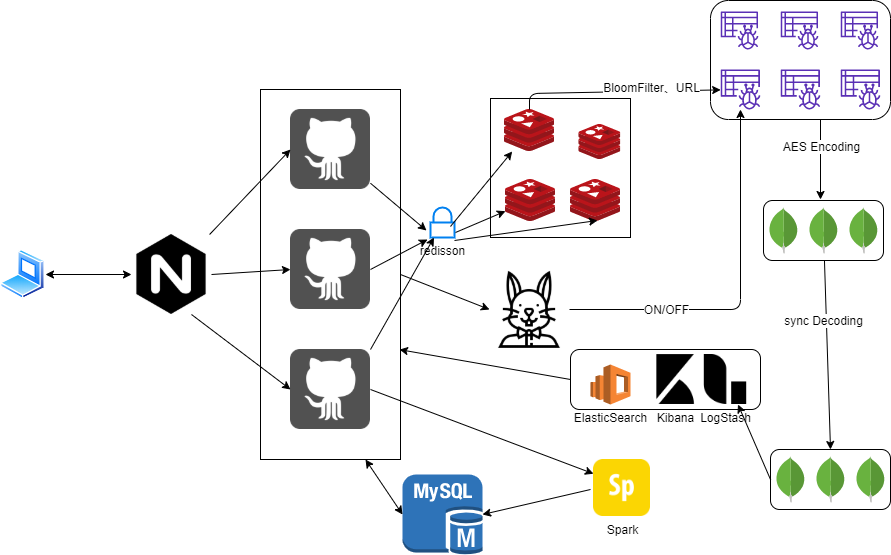

# 项目整体架构

## 项目思路 

该项目是某军方所需的型号项目，需要参与维护期超过三年，因此作为一个需要长期进行修改的爬虫项目，所以这里的爬虫模块需要具有易拓展且功能型号等优良特性





## 整体项目采用docker-Compose构建

## Nginx 代理

**知识点**

1.负载均衡：

轮询 遍历

随机访问 

最小连接

加权轮询

加权随机

这里用的是简单轮询 由于项目采用docker布置 配置完全相同


## 分布式锁 

一般为互斥

## Mysql

获得锁时创建唯一索引，释放锁时删除索引。

### 唯一索引：

缺点 

1. 没有过期时间 容易死锁

2. 非阻塞锁，插入失败，会直接报销

3. 是不可重入，已经获得锁，也必须重新去争抢锁


## Zookeeper

**三种角色**

Leader

Follower

Observer


**三种节点** 

临时节点 有序节点 永久节点

从而衍生出 

临时有序 

永久有序

目录结构 树结构


**锁的实现**


1. 创建lock

2. 创建临时有序节点

3. 客户端竞争 选择最小最前的

4. 完成后 删除对应节点 


类似于 出队 先来后到


**Server的选举**


## Redisson

Java api

```java
setNX() //SET something NX time
```
利用 多个进程去获取锁 这里主要用于避免重复布置爬虫任务，采用多个tomcat向redis集群请求锁，从而进行锁的竞争。


Redisson

RedLock

某进程向redis集群发送请求 在N个节点上各自创建一个具有过期时间的锁 锁的value为初始值0

发送请求，请求锁，谁先拿到 N/2 就可成功获取锁，其他进程处于自旋状态


**Redlock三个临界情况**

时间边际

网络边际

进程边际


## 分布式事务的区别分布式锁


分布式锁 用于竞争 

分布式事务 是需要保证事务的ACID 

**原子性 隔离性 一致性  持久性**


常见的分布式 事务由 

2pc 二阶段提交


角色 协调者 参与者 ES


3pc 三阶段提交

TCC 事务提交


CAP 一致性 可用性 分区容错性

BASE 基本可用 软状态 和最终一致性


分布式一致性算法


PAXOS

倡议者 提倡做什么 发出倡议 选举谁

接收者 接收者投票

学习者 得到结果 

正确性： 只有一个生效

可终止性： 最终只有一个倡议能够生效

RAFT


## 开发框架 SpringBoot

BeanFactory 是什么 Bean的工厂 用于加工 生产Bean

FactoryBean 加载工厂的Bean方法 


SpringBoot 最终的两点

IOC（DI） 控制反转 又叫做 依赖注入 将创建新类的权力交给IOC容器实现，从而实现控制权的反转，BeanFactory对象专注于实现业务，不用去管理对象。底层是一个类似于Map的结构 从xml进行读取

AOP 

面向切面编程

BeanFactory 和 ApplicationContext

@Mapper 
声明服务
@Service
服务注册
@Component
注册组件
@Transactional 

事务 

五个级别

默认

读未提交

读已提交

可重复读 

串行化

